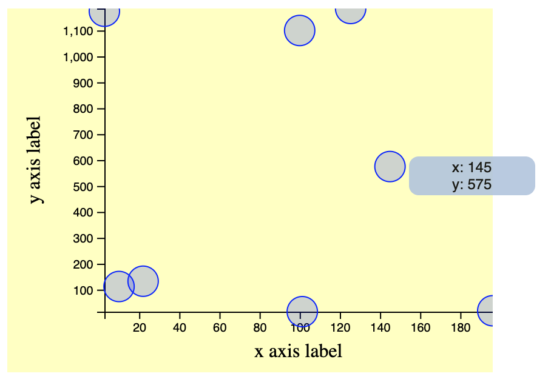
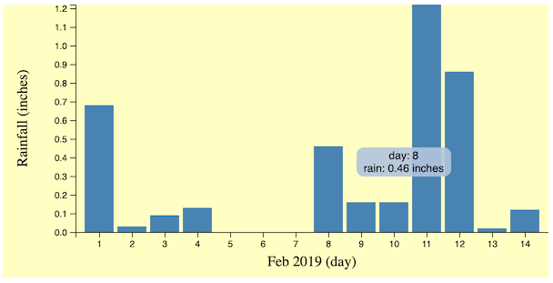

# nim-d3

Nim Foreign Function Interface (FFI) bindings to [d3.js](https://d3js.org).

This is in development and there is still a lot to be written.  There
is the ability to create a simple graph today.  See
[examples/](examples/) for usage.

## Install

nim-d3 is available in [nimble](https://github.com/nim-lang/nimble).

`nimble install d3`

or if you have a `.nimble` file then add the following.

`requires "d3 >= 0.1.2"`

NOTE: Run `nimble search d3 --ver` to find out the most recent version
of the library.

## Documentation

Clone the repo and generate the docs

`nimble docs`
